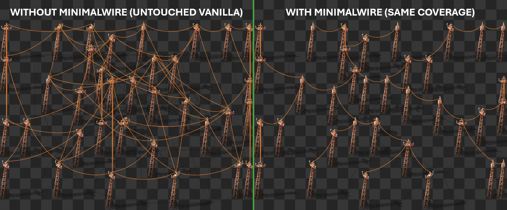

# ⚡ MinimalWire – Clean Power Networks

**MinimalWire** eliminates power pole spaghetti in [Factorio 2.0](https://factorio.com) by automatically enforcing efficient wire connections. Every time a pole is placed or removed, the mod computes a **Minimum Spanning Tree (MST)** using [Kruskal's algorithm](https://en.wikipedia.org/wiki/Kruskal%27s_algorithm), producing the cleanest possible wiring with the fewest connections.

> 🧹 No more messy criss-crossing wires. Just clean, minimal power networks.



---

## ✨ Features

- **Automatic MST wiring** – Poles are rewired optimally every time one is placed or removed
- **Deterministic tie-breaking** – Consistent, clean-looking results even with symmetrical pole layouts
- **Tick-spread operations** – Wire changes are spread across multiple game ticks to avoid UPS spikes
- **Quality-aware** – Correctly handles pole quality tiers and their different wire distances
- **Fully configurable** – Tune radius, pole limits, and performance via mod settings
- **Works with robots** – Handles both player and robot-placed/removed poles
- **Debug mode** – Visual overlays and console output for troubleshooting

---

## ⚙️ Settings

All settings are **runtime-global** and can be changed in Map Settings mid-game.

| Setting | Default | Range | Description |
|---|---|---|---|
| **MST Generation Radius** | 42 | 1–1000 | How far (in tiles) around a placed pole to search for other poles |
| **Maximum Poles in Radius** | 30 | 1–1000 | Max poles to include in a local MST rebuild |
| **Full-Network MST** | `false` | — | Rebuild the MST across the *entire* connected network instead of just nearby poles. ⚠️ Can be laggy on large networks, but useful for one-time cleanup |
| **Operations per Tick** | 10 | 1–1000 | Wire connect/disconnect operations per tick. Higher = faster but may cause lag spikes |
| **Debug Mode** | `false` | — | Print debug stats and draw visual overlays |

---

## 🔧 How It Works

1. When a **pole is placed**, the mod gathers all poles within the configured radius (or the full connected network, if enabled).
2. It builds a weighted graph of all possible pole-to-pole connections, respecting each pole's maximum wire distance.
3. **Kruskal's algorithm** computes the MST — the minimum set of connections that keeps every pole reachable.
4. Connections not in the MST are scheduled for removal; missing MST edges are scheduled for addition.
5. These changes are applied gradually over multiple ticks (controlled by *Operations per Tick*) to maintain UPS.
6. When a **pole is removed**, a temporary hidden dummy pole is created for one tick so the mod can re-evaluate and reconnect the remaining network optimally.

---

## 📦 Installation

1. Download from the [Factorio Mod Portal](https://mods.factorio.com/mod/minimalwire)
2. Or place this folder in your Factorio `mods/` directory

**Requires:** Factorio 2.0+

---

## 🤝 Contributing

**This mod is now community-maintained!** The original author ([SleepyStew](https://github.com/SleepyStew)) no longer has time to actively maintain it, so contributions from the community are very welcome.

### How to Contribute

- **Bug Reports** – Open an issue with steps to reproduce, your mod settings, and any error logs
- **Feature Requests** – Open an issue describing the feature and how it improves the mod
- **Pull Requests** – Fork the repo, make your changes, and open a PR. Please:
  - Keep changes focused and well-scoped
  - Test with a variety of pole configurations and network sizes
  - Update `changelog.txt` following the existing format
  - Bump the version in `info.json` for any release-worthy changes

### Project Structure

```
minimalwire_1.0.9/
├── info.json        # Mod metadata (name, version, description)
├── control.lua      # Core logic — MST algorithm, event handlers, tick scheduling
├── data.lua         # Prototype definitions (hidden dummy pole)
├── settings.lua     # Mod settings definitions
├── changelog.txt    # Version history
└── thumbnail.png    # Mod portal thumbnail
```

### Architecture Notes

- **`control.lua`** is the heart of the mod. Key systems:
  - `calculate_mst()` – Kruskal's algorithm with Union-Find
  - `rebuild_mst_for_subnetwork()` – Orchestrates gathering poles, computing MST, and scheduling wire changes
  - `gather_nearby_poles()` / `gather_connected_poles()` – Two strategies for finding relevant poles
  - `on_tick_handler()` – Processes connection/disconnection tasks across ticks
- **`data.lua`** defines `dummy-hidden-pole`, a zero-size invisible pole used during removal events to preserve network context for one tick
- **`settings.lua`** defines all user-configurable parameters

---

## 🐛 Known Issues & Areas for Improvement

- The pole cache (`pole_cache`) is never explicitly cleared — stale entries may accumulate during long sessions
- `gather_nearby_poles()` uses a two-pass search (small then large radius) that could be simplified
- The full-network MST mode can cause significant lag on very large networks
- No localisation support (all strings are hardcoded in English)

---

## 📜 License

This project is licensed under the [MIT License](LICENSE).